# Warehouse Inventory Management System

  
  
  

## Overview

This project is a warehouse inventory management application developed in C# and SQL Server AdventureWorks2022. The system allows users to search inventory items, view stock levels, monitor inventory across warehouse locations, and identify products that require replenishment.

The application was designed to simplify inventory tracking and provide quick access to stock information through a user-friendly interface.

  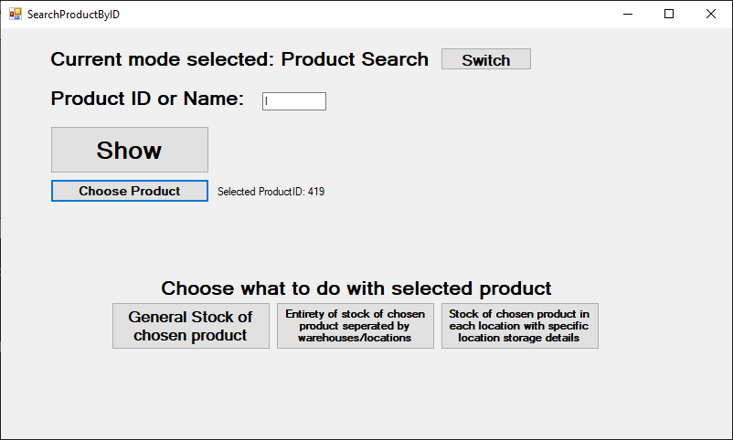

## Features

### Item Search

Users can search for an item by:

* Item code

  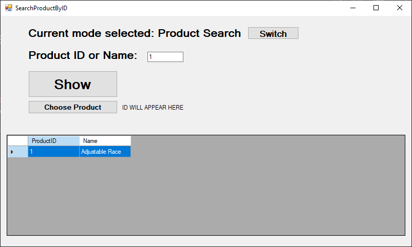

* Full item description

  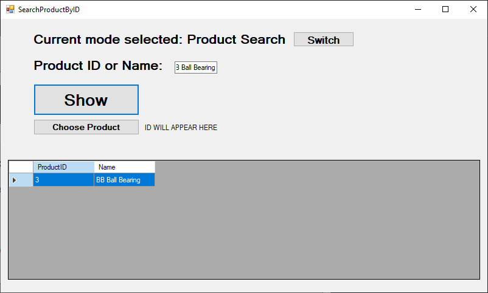

* Partial item description

  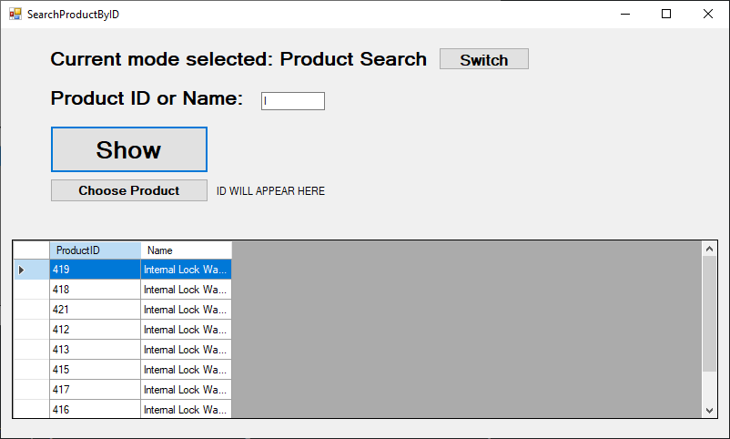

If multiple matching items are found, the results are displayed in a DataGridView, allowing the user to select the desired item by double-clicking it.

Before double-click 

  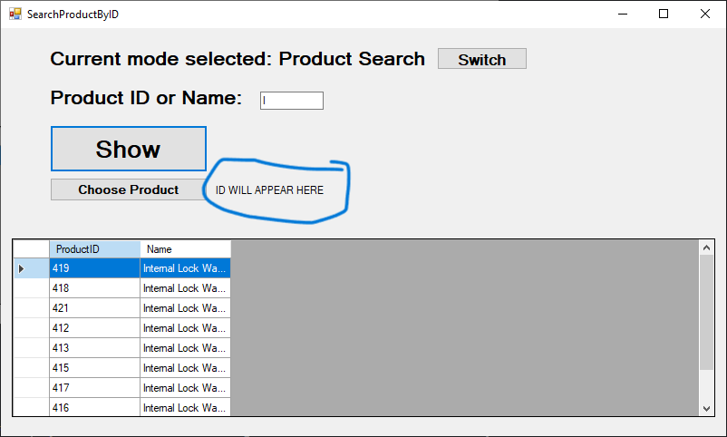

After 

  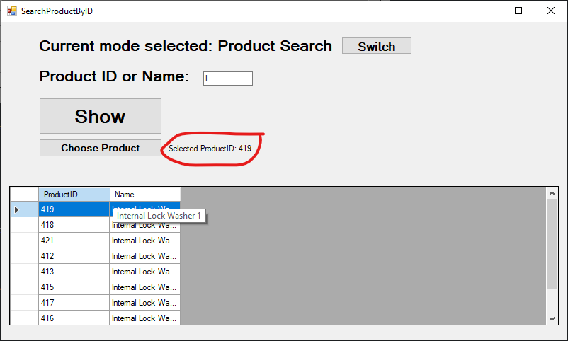

After selecting an item, you can choose one of the following functions via the buttons below:

  

Depending on the choice the following information can be displayed:

#### Total Inventory(General Stock of chosen product button)

Displays the total quantity available across all warehouse locations.

  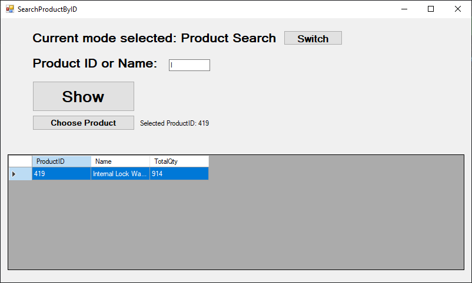

#### Inventory by Location(Entirety of stock of chosen product separated by warehouses/locations button)

Displays stock quantities grouped by warehouse location.

  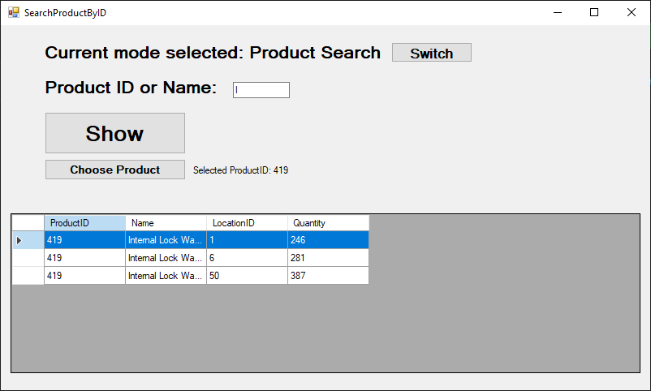

#### Detailed Inventory(Stock of chosen product in each location with specific storage details button)

Displays stock quantities by:

* Location
* Shelf
* Bin

  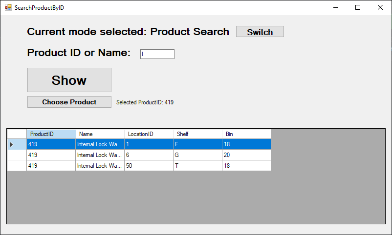

This allows users to identify the exact storage position of an item.

### General Inventory

Displays a complete inventory list containing:

* Item Code
* Item Description
* Quantity

  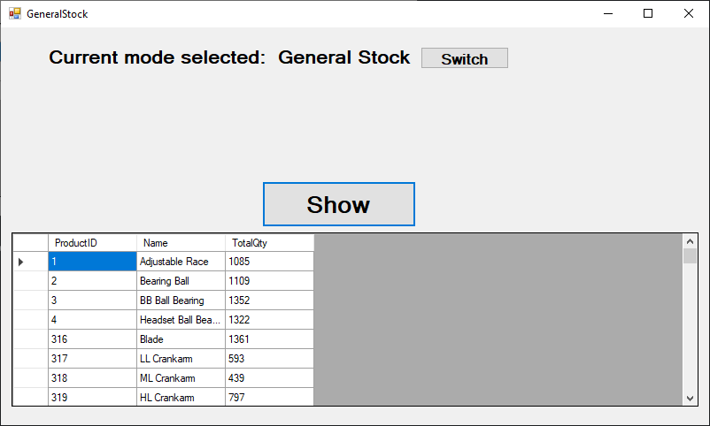

The quantity shown represents the total stock available across all warehouse locations.

### Reorder Report

Displays all items with stock levels below their Safety Stock Level.

  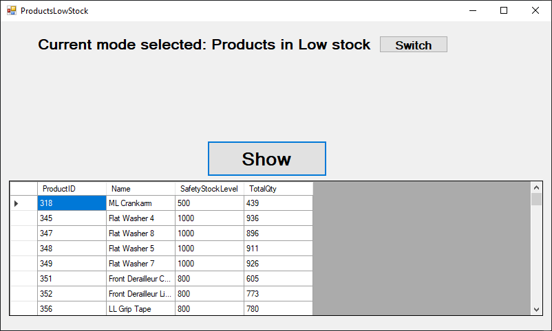

The report helps identify products that require replenishment before stock shortages occur.

For each item, the following information is displayed:

* Item Code
* Description
* Current Quantity
* Safety Stock Level

## Technologies Used

* C#
* Windows Forms
* SQL Server
* ADO.NET
* DataGridView
* AdventureWorks2022 Database https://learn.microsoft.com/en-us/sql/samples/adventureworks-install-configure?view=sql-server-ver17&tabs=ssms (AdventureWorks2022.bak)
* SQL Server Management Studio

## Application Structure

The application is divided into separate forms:

### Main Menu

Provides access to all system functions.

### Item Search Form

Allows users to search for items and view inventory information.

### General Inventory Form

Displays all inventory items and stock quantities.

### Reorder Report Form

Displays products that need to be reordered.

## Skills Demonstrated

- Object-Oriented Programming (OOP)
- SQL Database Design
- ADO.NET
- CRUD Operations
- DataGridView Integration
- User Interface Design
- SQL Query Optimization

## Installation

1. Clone the repository
2. Restore the AdventureWorks2022 database
3. Update the SQL Server connection string
4. Open the solution in Visual Studio
5. Build and run the application

## Author

Argyris Leakos
